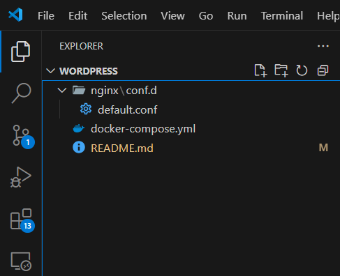
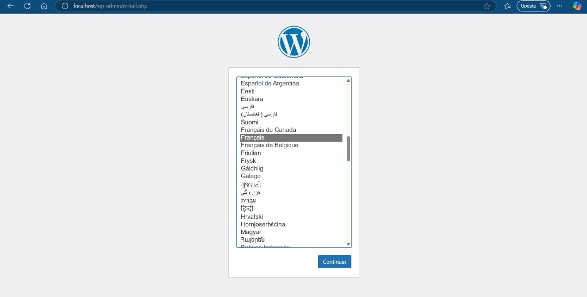
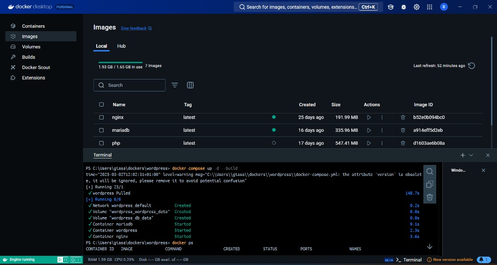
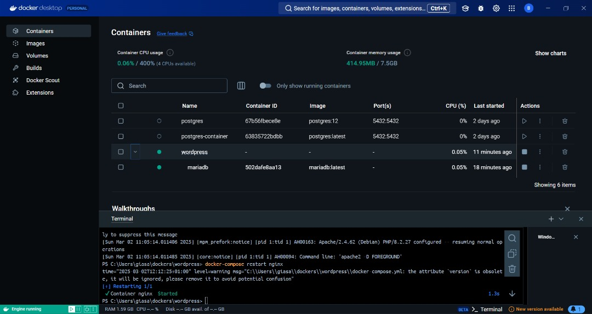

#test-ecole-it

# Gestion d'un site WordPress avec Docker 

Ce projet permet de déployer un site WordPress avec une base de données MariaDB, un serveur web Apache intégré à WordPress, et un proxy Nginx en front-end pour gérer les requêtes HTTP.

## Structure du projet

wordpress/
│── docker-compose.yml
│── nginx/
│   ├── conf.d/
│   │   ├── default.conf
│── README.md

##  Étapes d'installation et de configuration

###  Création d'un fichier `docker-compose.yml`
Créer un fichier `docker-compose.yml` avec le contenu suivant :

version: '3.8'

services:
  wordpress:
    image: wordpress:latest
    container_name: wordpress
    restart: always
    depends_on:
      - db
    environment:
      WORDPRESS_DB_HOST: db
      WORDPRESS_DB_USER: user
      WORDPRESS_DB_PASSWORD: password
      WORDPRESS_DB_NAME: wordpress
    volumes:
      - wordpress_data:/var/www/html

  db:
    image: mariadb:latest
    container_name: mariadb
    restart: always
    environment:
      MYSQL_ROOT_PASSWORD: rootpassword
      MYSQL_DATABASE: wordpress
      MYSQL_USER: user
      MYSQL_PASSWORD: password
    volumes:
      - db_data:/var/lib/mysql

  nginx:
    image: nginx:latest
    container_name: nginx
    restart: always
    ports:
      - "80:80"
    volumes:
      - ./nginx/conf.d:/etc/nginx/conf.d
      - wordpress_data:/var/www/html
    depends_on:
      - wordpress

volumes:
  wordpress_data:
  db_data:

###  Configurer Nginx
Créer le dossier de configuration de Nginx :

mkdir -p nginx/conf.d

Créer et éditer le fichier `nginx/conf.d/default.conf` :

touch nginx/conf.d/default.conf
nano nginx/conf.d/default.conf

Ajouter le contenu suivant :
nginx
server {
    listen 80;
    server_name localhost;

    location / {
        proxy_pass http://wordpress:80;
        proxy_set_header Host $host;
        proxy_set_header X-Real-IP $remote_addr;
        proxy_set_header X-Forwarded-For $proxy_add_x_forwarded_for;
        proxy_set_header X-Forwarded-Proto $scheme;
    }
}

###  Lancer le projet
Démarrer les services Docker :

docker-compose up -d

### Vérifier les conteneurs
S'assurer que tous les conteneurs sont en cours d'exécution :

docker ps

Si un conteneur est arrêté, voir ses logs :

docker logs wordpress

docker logs nginx

### Accéder au site WordPress
Ouvrir [http://localhost](http://localhost) dans votre navigateur.

---
##  Commandes utiles
- **Arrêter les services** :
  
  docker-compose down
  
    ##Redémarrer les services :
  
  docker-compose restart
  
- **Recréer les conteneurs en supprimant les anciens** :
  
  docker-compose up -d --build
 

